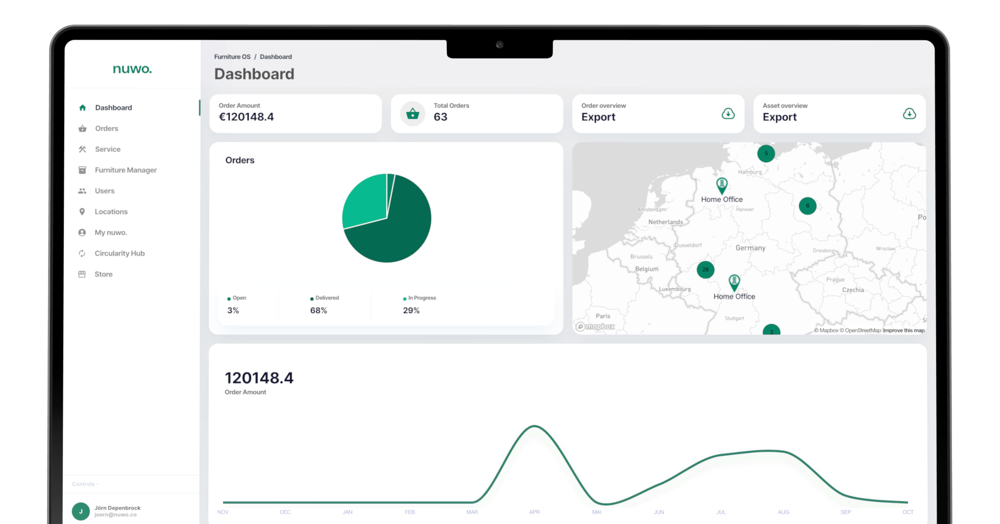
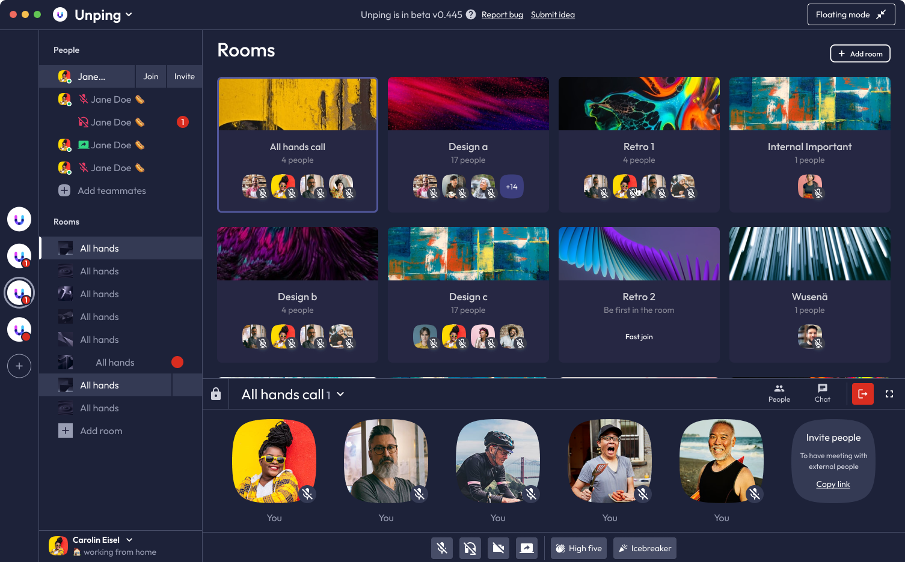
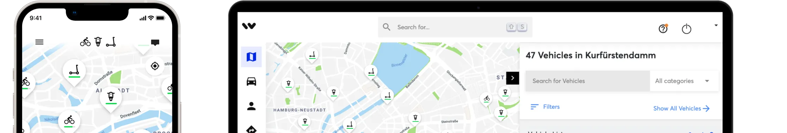
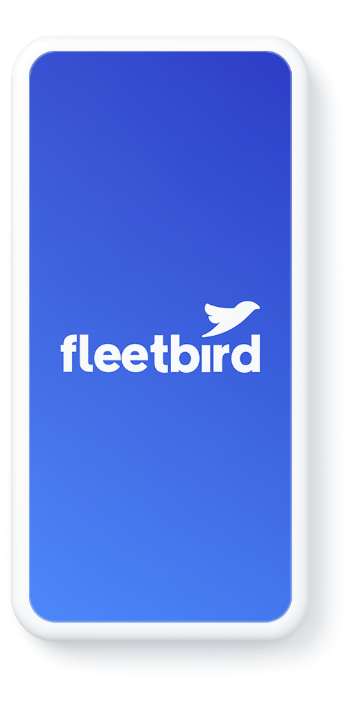
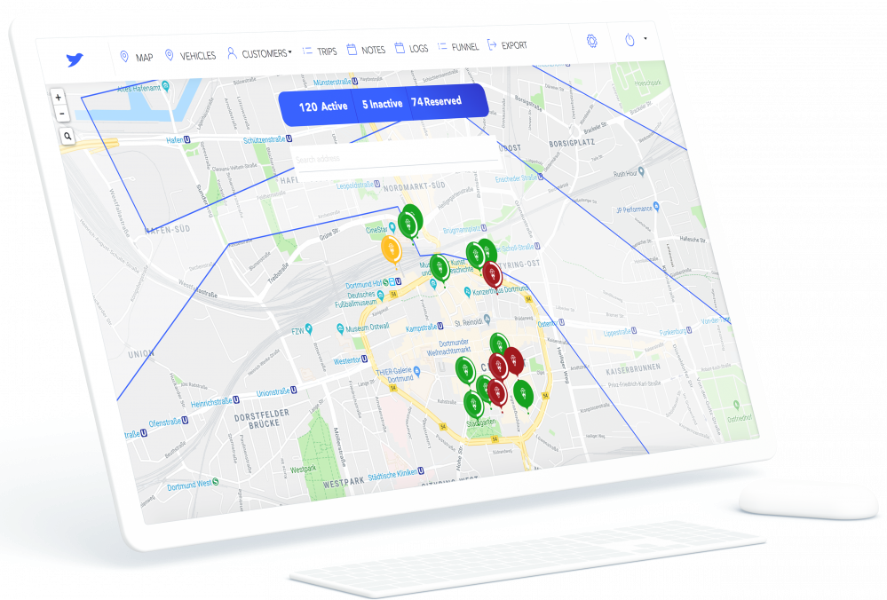
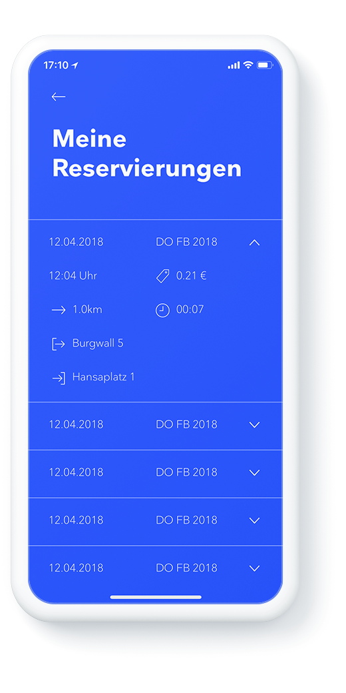
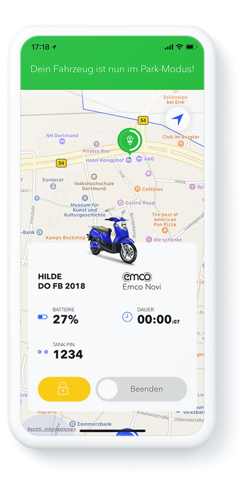

<h1 align="center">Hi 👋, I'm Jörn</h1>
<h3 align="center">Serial Entrepreneur, Full Stack Engineer, Advisor</h3>

- 🔭 I'm currently working on **🚗⚡ Something big in e-mobility charging... Stay tuned.**

- 💬 Ask me about **Leadership, Startup, AI, PHP, Dart, JavaScript, Yii2, Flutter, AWS, Web, MacOS**

<h2 align="left">Connect with me:</h3>

- LinkedIn [https://www.linkedin.com/in/jdde/](https://www.linkedin.com/in/jdde/)
- Mail 📫 **ping@jdde.de**

<h2 align="left">Projects</h1>
<table>
  <tbody>
    <tr>
      <td colspan="2">
        <h3>⚡️ Stealth Project - E-Mobility Charging</h3>
      </td>
    </tr>
    <tr>
      <td width="50%">
        <ul>
          <li><b>Position:</b> Founder</li>
          <li><b>Location:</b> Germany</li>
          <li><b>Start:</b> 1725148800 (2024-09-01)</li>
          <li><b>End:</b> -</li>
        </ul>
      </td>
      <td width="50%">
        

          <b>🤫 Coming Soon...</b>  
          Building something that will reshape the e-mobility charging landscape. The future of electric vehicle infrastructure is about to get a lot more interesting.  
          <i>Want to be the first to know? Connect with me on LinkedIn.</i>
        

      </td>
    </tr>
    <tr>
      <td colspan="2" align="center">
        
         
        <b>⚡ Reveal coming soon ⚡</b>
      </td>
    </tr>
    <tr>
      <td colspan="2">
        <h3><a href="https://www.nuwo.co" target="_blank" style="font-size: 1.5em; font-weight: bold;">nuwo. furnitureOS: End-To-End Technology for Purchasing and Managing Office Furniture.</a></h3>
      </td>
    </tr>
    <tr>
      <td width="50%">
        <ul>
          <li><b>Position:</b> CTO & Co-Founder</li>
          <li><b>Location:</b> Berlin/Germany</li>
          <li><b>Start:</b> 1669852800 (2022-12-01)</li>
          <li><b>End:</b> 1724976000 (2024-08-31)</li>
        </ul>
      </td>
      <td width="50%">
        

          Responsible for nuwo's technology and product vision and execution. Built the platform’s first version, defined its core architecture, and continually integrated new features and bug fixes. Hired and led a team of 5 engineers to bring our vision to life. With my team I ensure, that we're able to compete in a fast and flexible way in a non-digitized market and lead the industry into a digital future.
        

      </td>
    </tr>
    <tr>
      <td colspan="2">
        
      </td>
    </tr>
    <tr>
      <td colspan="2">
        
        
        
        
        
        
        
        
        
        
        
        
        
         
      </td>
    </tr>
    <tr>
      <td colspan="2">
        <h3><a href="https://www.unping.com/app" target="_blank" style="font-size: 1.5em; font-weight: bold;">Unping - Next-level collaboration for remote & hybrid teams.</a></h3>
      </td>
    </tr>
    <tr>
      <td width="50%">
        <ul>
            <li><b>Position:</b> CTO & Co-Founder</li>
            <li><b>Location:</b> Dortmund/Germany</li>
            <li><b>Start:</b> 1640995200 (2022-01-01)</li>
            <li><b>End:</b> 1669852800 (2022-12-01)</li>
        </ul>
      </td>
      <td width="50%">
        

          As founder and CTO of Unping, I defined the technology vision, creating a robust end-to-end architecture from backend to one of the first Flutter desktop apps. Contributed 4,500+ commits in the first year, iterating rapidly to enhance stability. Built and scaled the tech team, leading key technical decisions to deliver a high-performance platform that boosted team productivity by 30% for early users.
        

      </td>
    </tr>
    <tr>
      <td colspan="2">
        
      </td>
    </tr>
    <tr>
      <td colspan="2">
        
        
        
        
        
        
        
        
        
        
        
        
        
         
         
      </td>
    </tr>
    <tr>
      <td colspan="2">
        <h3><a href="https://www.wundermobility.com" target="_blank" style="font-size: 1.5em; font-weight: bold;">WunderMobility - Whitelabel Vehicle Sharing Platform</a></h3>
      </td>
    </tr>
    <tr>
      <td width="50%">
        <ul>
            <li><b>Position:</b> Engineering Manager</li>
            <li><b>Location:</b> Hamburg/Germany</li>
            <li><b>Start:</b> 1546300800 (2019-01-01)</li>
            <li><b>End:</b> 1612051200 (2021-12-31)</li>
        </ul>
      </td>
      <td width="50%">
        

          After acquisition I lead a team of 5, managing the technical integration during Wunder Mobility’s acquisition of Fleetbird. As Engineering Manager, I scaled the backend team from 5 to 25, creating and overseeing the hiring process to build a high-performing team of four specialized sub-teams. I introduced key working processes, including agile methodologies, retrospectives, and Git flow, to drive efficiency and collaboration. Increased test coverage from 0% to over 95%, achieving near 100% system uptime (with > 10000 requests/second) and enhanced platform stability. Implemented safeguards to ensure new features wouldn’t disrupt existing functionalities. Balanced leadership with hands-on involvement, shaping the technology roadmap and empowering teams to take ownership of their domains.
        

      </td>
    </tr>
    <tr>
      <td colspan="2">
        
      </td>
    </tr>
    <tr>
      <td colspan="2">
        
        
        
        
        
        
        
        
        
        
        
        
         
        
         
        
        
      </td>
    </tr>
    <tr>
      <td colspan="2">
        <h3><a href="https://www.fleetbird.com" target="_blank" style="font-size: 1.5em; font-weight: bold;">Fleetbird - Whitelabel Vehicle Sharing Platform</a></h3>
      </td>
    </tr>
    <tr>
      <td width="50%">
        <ul>
            <li><b>Position:</b> Backend Team Lead & Engineer</li>
            <li><b>Location:</b> Dortmund/Germany</li>
            <li><b>Start:</b> 1512086400 (2017-12-01)</li>
            <li><b>End:</b> 1546214400 (2018-12-31)</li>
        </ul>
      </td>
      <td width="50%">
        

          As the 5th Employee I was in charge of co-architecting base features, structures and improvements in the very first fleetbird.com B2B Whitelabel Sharing Provider System. My biggest achievement was to contribute significantly to the acquisition of WunderMobility and handle huge parts of the tech due diligence.
        

      </td>
    </tr>
    <tr>
      <td colspan="2">
        
        
        
        
      </td>
    </tr>
    <tr>
      <td colspan="2">
        
        
        
        
        
        
         
        
        
        
      </td>
    </tr>
    <tr>
      <td colspan="2">
        <h3><a href="https://www.caregaroo.de" target="_blank" style="font-size: 1.5em; font-weight: bold;">Caregaroo - Marketplace Platform for Babysitter & Parent matching</a></h3>
      </td>
    </tr>
    <tr>
      <td width="50%">
        <ul>
            <li><b>Position:</b> CTO & Co-Founder</li>
            <li><b>Location:</b> Dortmund/Germany</li>
            <li><b>Start:</b> 1433116800 (2015-06-01)</li>
            <li><b>End:</b> 1512086400 (2017-11-31)</li>
        </ul>
      </td>
      <td width="50%">
        

          At Caregaroo, my first startup, I independently built the entire frontend, backend, and mobile web app, gaining foundational expertise in full-stack development. This experience taught me the architecture of web applications, REST APIs, and JavaScript across the stack, while I implemented Angular for the frontend and Ionic for mobile web app architecture. Building every layer from scratch deepened my understanding of scalable, responsive applications and fueled my passion for innovative software development.
        

      </td>
    </tr>
    <tr>
      <td colspan="2">
        
      </td>
    </tr>
    <tr>
      <td colspan="2">
        
        
        
        
        
        
        
        
        
        
         
        
        
        
        
        
        
        
      </td>
    </tr>
  </tbody>
</table>

