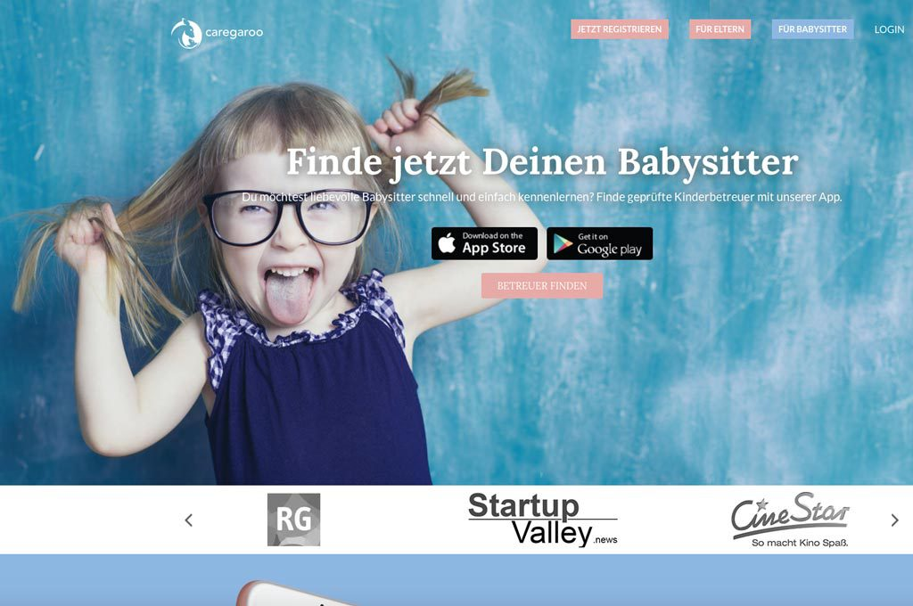

<h1 align="center">Hi 👋, I'm Jörn</h1>
<h3 align="center">Serial Entrepreneur, Full Stack Engineer, Advisor, Investor</h3>

- 🔭 I’m currently working on [nuwo. furnitureOS: The first and only End-To-End Technology for Purchasing and Managing Office Furnitures](https://www.nuwo.co)

- 💬 Ask me about **Team Leadership, Startup, Scaling, AI, PHP, Dart, JavaScript, TypeScript, Yii2, Flutter, AWS, Web**

- 📫 How to reach me **ping@jdde.de**

- 📄 Know about my experiences [https://www.linkedin.com/in/jdde/](https://www.linkedin.com/in/jdde/)

<h2 align="left">Connect with me:</h3>

<h2 align="left">Projects</h1>
<table>
  <tbody>
    <tr>
      <td colspan="2">
        <a href="https://www.nuwo.co" target="_blank" style="font-size: 1.5em; font-weight: bold;">www.nuwo.co</a>
      </td>
    </tr>
    <tr>
      <td width="50%">
        <ul>
          <li><b>Position:</b> CTO & Co-Founder</li>
          <li><b>Location:</b> Berlin/Germany</li>
          <li><b>Start:</b> 1669852800 (2022-12-01)</li>
          <li><b>End:</b> -</li>
        </ul>
      </td>
      <td width="50%">
        

          Building the first and only End-To-End Technology for Purchasing and Managing Office Furniture.
          I'm building and leading a high performing engineering team to enable our business vision. Beside that I'm responsible for Product and Technology decisions for ensuring our success.
        

      </td>
    </tr>
    <tr>
      <td colspan="2">
        
      </td>
    </tr>
    <tr>
      <td colspan="2">
        <a href="https://www.unping.com/app" target="_blank" style="font-size: 1.5em; font-weight: bold;">www.unping.com</a>
      </td>
    </tr>
    <tr>
      <td width="50%">
        <ul>
            <li><b>Position:</b> CTO & Co-Founder</li>
            <li><b>Location:</b> Dortmund/Germany</li>
            <li><b>Start:</b> 1640995200 (2022-01-01)</li>
            <li><b>End:</b> 1669852800 (2022-12-01)</li>
        </ul>
      </td>
      <td width="50%">
        

          Change how we work together now and in the future.
        

      </td>
    </tr>
    <tr>
      <td colspan="2">
        
      </td>
    </tr>
    <tr>
      <td colspan="2">
        <a href="https://www.wundermobility.com" target="_blank" style="font-size: 1.5em; font-weight: bold;">www.wundermobility.com</a>
      </td>
    </tr>
    <tr>
      <td width="50%">
        <ul>
            <li><b>Position:</b> Engineering Manager</li>
            <li><b>Location:</b> Hamburg/Germany</li>
            <li><b>Start:</b> 1546300800 (2019-01-01)</li>
            <li><b>End:</b> 1612051200 (2021-12-31)</li>
        </ul>
      </td>
      <td width="50%">
        

          Enable companies to run their shared mobility business.
        

      </td>
    </tr>
    <tr>
      <td colspan="2">
        
      </td>
    </tr>
    <tr>
      <td colspan="2">
        <a href="https://www.fleetbird.com" target="_blank" style="font-size: 1.5em; font-weight: bold;">www.fleetbird.com</a>
      </td>
    </tr>
    <tr>
      <td width="50%">
        <ul>
            <li><b>Position:</b> Backend Team Lead & Engineer</li>
            <li><b>Location:</b> Dortmund/Germany</li>
            <li><b>Start:</b> 1512086400 (2017-12-01)</li>
            <li><b>End:</b> 1546214400 (2018-12-31)</li>
        </ul>
      </td>
      <td width="50%">
        

          As the 5th Employee I was in charge of co-founding the whole technical backend structure of fleetbird. Scaled the team forom 5 to 30 engineers, including due diligences, setting up team structures and handling the acquisition Process to Wundermobility.
        

      </td>
    </tr>
    <tr>
      <td colspan="2">
        
        
        
        
      </td>
    </tr>
    <tr>
      <td colspan="2">
        <a href="https://www.caregaroo.de" target="_blank" style="font-size: 1.5em; font-weight: bold;">www.caregaroo.de</a>
      </td>
    </tr>
    <tr>
      <td width="50%">
        <ul>
            <li><b>Position:</b> CTO & Co-Founder</li>
            <li><b>Location:</b> Dortmund/Germany</li>
            <li><b>Start:</b> 1433116800 (2015-06-01)</li>
            <li><b>End:</b> 1512086400 (2017-11-31)</li>
        </ul>
      </td>
      <td width="50%">
        

          Helping parents to find reliable babysitters. Helping Babysitters to find trustful parents. Helping those both to cut appointment and accounting issues.
        

      </td>
    </tr>
    <tr>
      <td colspan="2">
        
      </td>
    </tr>
    <tr>
      <td colspan="2">
        <h3 align="left">Technologies used:</h3>
        
      </td>
    </tr>
  </tbody>
</table>

